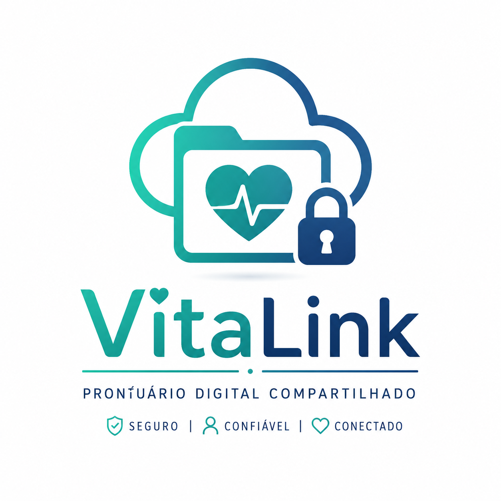

<div align="center">




---

*"Sua saúde. Seus dados. Seu controle."*

</div>

---

# 📖 Sobre o Projeto

O **VitaLink** é uma proposta de sistema para gerenciamento seguro de informações médicas.

O objetivo é permitir que pacientes mantenham um histórico digital de sua saúde, reunindo exames, consultas, receitas, laudos e imagens médicas em um único ambiente.

Os profissionais de saúde poderão registrar atendimentos, anexar documentos e consultar informações dos pacientes **somente mediante autorização**.

Este projeto está sendo desenvolvido na disciplina de **Engenharia de Software Seguro**, com foco na análise de ameaças, casos de abuso e requisitos de segurança antes da implementação.

---

# 🎯 Objetivos

- Centralizar informações médicas
- Facilitar o compartilhamento entre paciente e profissional
- Garantir privacidade dos dados
- Proteger informações sensíveis
- Aplicar princípios de Engenharia de Software Seguro
- Realizar Modelagem de Ameaças utilizando STRIDE

---

# 👥 Perfis de Usuário

## 🧑 Paciente

O paciente poderá:

- Criar conta
- Fazer login
- Editar perfil
- Anexar exames
- Anexar receitas
- Anexar laudos
- Anexar imagens médicas
- Registrar consultas
- Visualizar histórico médico
- Compartilhar informações
- Revogar acesso de profissionais
- Consultar histórico de acessos

---

## 👨‍⚕️ Profissional de Saúde

O profissional poderá:

- Criar conta profissional
- Fazer login
- Solicitar acesso ao paciente
- Registrar consultas
- Adicionar exames
- Adicionar laudos
- Adicionar receitas
- Consultar pacientes autorizados
- Atualizar informações médicas

---

# 🔐 Principais Recursos Protegidos

- 👤 Dados pessoais
- 📄 Exames
- 🩺 Consultas
- 💊 Receitas
- 🖼️ Imagens médicas
- 📑 Laudos
- 🔑 Senhas
- 🔐 Tokens
- 🗄 Banco de Dados
- 🌐 API
- ☁️ Servidor
- 📜 Logs do sistema

---


# 🔄 Fluxo do Sistema

```text
Paciente
    │
    │ Faz upload de exames
    │
    ▼
VitaLink
    │
    ├── Armazena documentos
    ├── Gerencia permissões
    ├── Registra acessos
    │
    ▼
Profissional autorizado
```

---

# 🛡 Modelagem de Ameaças (STRIDE)

| Categoria | Exemplo |
|------------|---------|
| 🕵️ Spoofing | Falso médico acessa o sistema |
| ✏️ Tampering | Alteração de exames |
| 🚫 Repudiation | Usuário nega ter alterado um prontuário |
| 🔓 Information Disclosure | Vazamento de exames |
| ⚠️ Denial of Service | Sistema indisponível |
| 👑 Elevation of Privilege | Paciente obtém privilégios administrativos |

---

# 🚨 Casos de Abuso

- Cadastro de falso profissional
- Roubo da conta do paciente
- Acesso sem autorização
- Alteração de exames
- Exclusão de laudos
- Compartilhamento indevido
- Ataque ao banco de dados
- Ataque de negação de serviço
- Vazamento de informações médicas
- Uso de permissões expiradas

---


# 👩‍💻 Integrantes


* Amanda Dias
* Camilla Borchhardt
* Milena Castro
* Rafela Nunes
* Tauani Sauceda
---

# 📚 Disciplina

**Engenharia de Software Seguro**

---

# ❤️ Nossa missão

Desenvolver um sistema que coloque o paciente no controle dos seus próprios dados de saúde, garantindo **privacidade**, **segurança** e **compartilhamento consciente** das informações médicas.

---

<div align="center">

## 💙 VitaLink

### Sua saúde. Seus dados. Seu controle.


</div>
