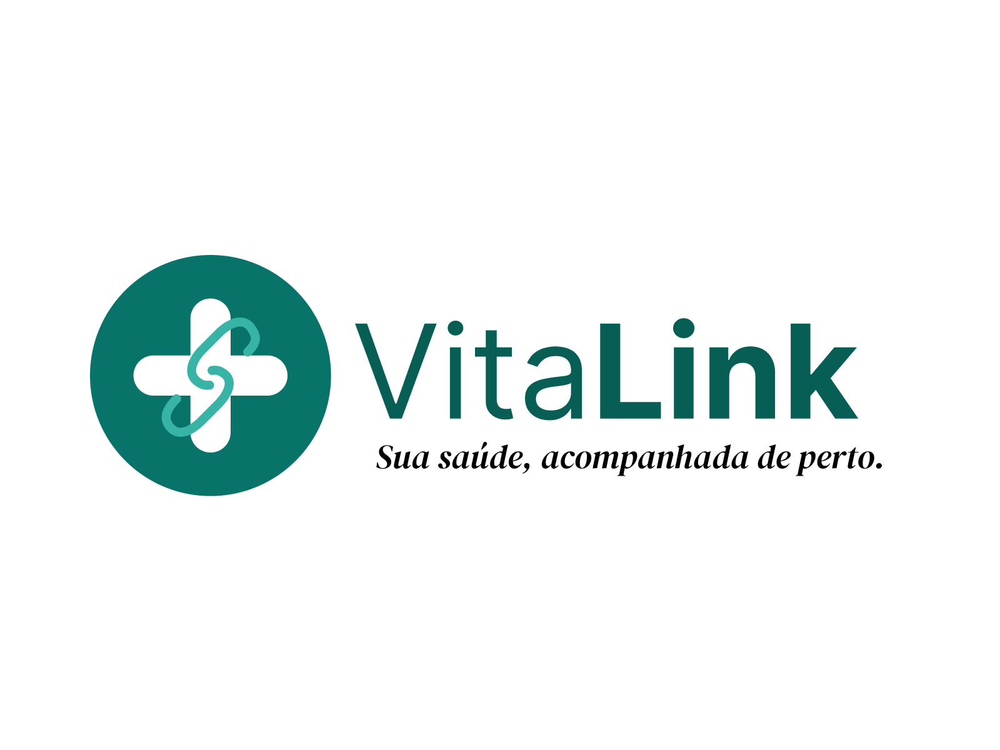

<div align="center">



# VitaLink

_Sua saúde. Seus dados. Seu controle._

</div>

## Escopo e estado atual

O VitaLink é uma proposta acadêmica de sistema para gerenciamento seguro de informações médicas. Pacientes mantêm o próprio histórico e decidem quando profissionais de saúde podem acessá-lo. O repositório contém a análise e o planejamento de segurança, o frontend de referência exportado do Figma Make e fatias executáveis de contas, sessões, perfis próprios, autorizações, observações pessoais e documentos privados verificados. As demais telas do protótipo não comprovam implementação até que suas issues produzam código, testes e evidências próprias.

Nesta documentação, os termos têm significado explícito:

- **Estado atual:** artefato ou evidência presente no repositório.
- **Proposto:** requisito, controle ou decisão planejada, ainda sem comprovação de implementação.
- **Evidência:** saída, teste, relatório ou outro artefato reproduzível versionado.
- **[A confirmar]:** informação ainda não documentada ou não validável.

## Perfis e ativos principais

| Perfil                   | Papel documentado                                                          |
| ------------------------ | -------------------------------------------------------------------------- |
| Paciente                 | Mantém dados próprios, compartilha informações e concede ou revoga acesso. |
| Profissional de Saúde    | Solicita acesso e atua apenas no escopo de autorização ativa.              |
| Administrador ou Suporte | Fora do escopo atual; não recebe permissão.                                |

Os ativos incluem dados pessoais (A01–A02), dados e documentos médicos (A03–A05 e A12), credenciais e tokens (A06–A07), auditoria (A08) e componentes internos (A09–A11). Consulte o [inventário](docs/inventario-de-ativos.md) e a [classificação CIA](docs/classificacao-cia-dos-ativos.md).

## Navegação por etapa

| Etapa                       | Status documental                                                                                                                                         | Artefatos locais                                                                                                                                                                                                                                                                                                                                                                                                                                                                                                                                                                                                                                                                                                                                                     |
| --------------------------- | --------------------------------------------------------------------------------------------------------------------------------------------------------- | -------------------------------------------------------------------------------------------------------------------------------------------------------------------------------------------------------------------------------------------------------------------------------------------------------------------------------------------------------------------------------------------------------------------------------------------------------------------------------------------------------------------------------------------------------------------------------------------------------------------------------------------------------------------------------------------------------------------------------------------------------------------- |
| Base                        | Documentada                                                                                                                                               | [Perfis e permissões](docs/usuarios-perfis-e-permissoes.md), [autorização e revogação](docs/fluxo-autorizacao-revogacao.md)                                                                                                                                                                                                                                                                                                                                                                                                                                                                                                                                                                                                                                          |
| 1. Ameaças e casos de abuso | Documentada, com lacunas de implementação marcadas                                                                                                        | [Índice STRIDE e casos de abuso](docs/etapa1-modelagem-de-ameacas.md), [identidade](docs/ameacas-identidade-autenticacao-privilegios.md), [consentimento](docs/ameacas-consentimento-acesso-indevido.md), [integridade](docs/casos-de-abuso-integridade.md), [disponibilidade](docs/ameacas-disponibilidade.md)                                                                                                                                                                                                                                                                                                                                                                                                                                                      |
| 2. Riscos e NIST CSF 2.0    | Planejada e documentada; residual apenas estimado                                                                                                         | [Critérios](docs/etapa2-criterios-e-risco-residual.md), [registro e tratamento](docs/etapa2-riscos-e-tratamento.md)                                                                                                                                                                                                                                                                                                                                                                                                                                                                                                                                                                                                                                                  |
| 3. Arquitetura segura       | Proposta; sem implementação verificável                                                                                                                   | [Requisitos e decisões](docs/etapa3-arquitetura-segura.md), [diagrama-fonte Mermaid](docs/diagramas/arquitetura-segura.mmd), [diagrama de contexto](docs/diagrama-contexto.md)                                                                                                                                                                                                                                                                                                                                                                                                                                                                                                                                                                                       |
| Implementação               | Contas, sessões, perfis, autorização temporária, observações pessoais versionadas, documentos privados, resultados estruturados e registros profissionais executáveis; demais fatias planejadas | [Evidência da issue #50](docs/implementacao-issue-50.md), [evidência da issue #51](docs/implementacao-issue-51.md), [evidência da issue #52](docs/implementacao-issue-52.md), [evidência da issue #53](docs/implementacao-issue-53.md), [evidência da issue #54](docs/implementacao-issue-54.md), [evidência da issue #55](docs/implementacao-issue-55.md), [evidência da issue #56](docs/implementacao-issue-56.md), [evidência da issue #57](docs/implementacao-issue-57.md), [evidência da issue #58](docs/implementacao-issue-58.md), [evidência da issue #59](docs/implementacao-issue-59.md), [evidência da issue #60](docs/implementacao-issue-60.md), [plano de implementação](docs/plano-implementacao-primeira-versao.md), [inventário da interface](docs/inventario-interface-primeira-versao.md), [`VitaLink Health Management App/`](VitaLink%20Health%20Management%20App/) |
| 4. Código seguro            | Primeira fatia implementada; demais controles pendentes                                                                                                   | [Código seguro](docs/etapa4-codigo-seguro.md), [evidência da issue #50](docs/implementacao-issue-50.md)                                                                                                                                                                                                                                                                                                                                                                                                                                                                                                                                                                                                                                                              |
| 5. Verificação de segurança | TDD das issues #50 a #60 executado; matriz restante pendente                                                                                              | [Verificação de segurança](docs/etapa5-verificacao-de-seguranca.md), [evidência da issue #50](docs/implementacao-issue-50.md), [evidência da issue #51](docs/implementacao-issue-51.md), [evidência da issue #52](docs/implementacao-issue-52.md), [evidência da issue #53](docs/implementacao-issue-53.md), [evidência da issue #54](docs/implementacao-issue-54.md), [evidência da issue #55](docs/implementacao-issue-55.md), [evidência da issue #56](docs/implementacao-issue-56.md), [evidência da issue #57](docs/implementacao-issue-57.md), [evidência da issue #58](docs/implementacao-issue-58.md), [evidência da issue #59](docs/implementacao-issue-59.md), [evidência da issue #60](docs/implementacao-issue-60.md)                                                                                       |
| 6. Monitoramento e detecção | Roteiro e regras propostos; sem monitoramento ativo                                                                                                       | [Monitoramento e detecção](roteiros/etapa-6-deteccao-de-intrusoes.md)                                                                                                                                                                                                                                                                                                                                                                                                                                                                                                                                                                                                                                                                                                |
| 7. DevSecOps e vídeo        | Pipeline DevSecOps proposto; vídeo final pendente                                                                                                         | [DevSecOps e vídeo](roteiros/etapa-7-devsecops-e-video-final.md)                                                                                                                                                                                                                                                                                                                                                                                                                                                                                                                                                                                                                                                                                                     |

## Rastreabilidade central

Os identificadores estáveis são `Axx` (ativos), `Txx` (ameaças), `CAxx` (casos de abuso), `Rxx` (riscos), `RSxx` (requisitos), `Vxx` (vulnerabilidades candidatas), `DAxx` (decisões arquiteturais) e `Dxx` (regras de detecção). A [Etapa 1](docs/etapa1-modelagem-de-ameacas.md) liga ativos, ameaças e abusos. A [Etapa 2](docs/etapa2-riscos-e-tratamento.md) liga ameaças, riscos, NIST CSF 2.0, controles propostos, responsáveis propostos e verificação necessária. A [Etapa 3](docs/etapa3-arquitetura-segura.md) liga riscos a requisitos, vulnerabilidades candidatas e decisões.

As decisões de escopo, autorização, sessão, auditoria e detecção estão em [decisões de segurança propostas](docs/decisoes-de-seguranca.md).

## Evidências e participação

A [auditoria de evidências do repositório](docs/evidencias-repositorio.md) registra o que foi encontrado no histórico Git e o que ainda não pode ser comprovado. Ela não substitui a conferência no GitHub após o push.

## Integrantes

- Amanda Dias
- Camilla Borchhardt
- Luiza Figueiredo
- Milena Castro
- Rafaela Nunes
- Tauani Sauceda

O histórico do projeto contém contribuições associadas a Amanda, Camilla, Luiza, Milena, Rafaela e Tauani. A documentação de participação e as limitações da inspeção estão registradas em [evidências](docs/evidencias-repositorio.md).

## Ambiente local

O projeto declara Python 3.12 e `uv` em [pyproject.toml](pyproject.toml). A execução reproduzível usa [Docker Compose](compose.yaml), e o frontend possui comandos próprios em [`package.json`](VitaLink%20Health%20Management%20App/package.json). O procedimento, os limites e as verificações da primeira fatia estão em [Implementação da issue #50](docs/implementacao-issue-50.md).

### Executar o sistema

Pré-requisitos: Docker Engine e Docker Compose v2.

1. Crie o arquivo local de configuração e substitua `VITALINK_SECRET_KEY` por um segredo aleatório com pelo menos 32 caracteres:

   ```bash
   cp .env.example .env
   python3 -c 'import secrets; print(secrets.token_urlsafe(32))'
   ```

2. Inicie e construa os serviços:

   ```bash
   docker compose up --build
   ```

3. Acesse:
   - sistema: <https://localhost>;
   - caixa de e-mails local: <http://localhost:8025>.

O HTTPS usa um certificado local gerado pelo Caddy. No primeiro acesso, o navegador pode exibir `NET::ERR_CERT_AUTHORITY_INVALID`; em desenvolvimento, selecione **Avançado** e prossiga para `localhost`.

Para executar em segundo plano, consultar o estado e encerrar sem remover os dados:

```bash
docker compose up -d --build
docker compose ps
docker compose stop
```
