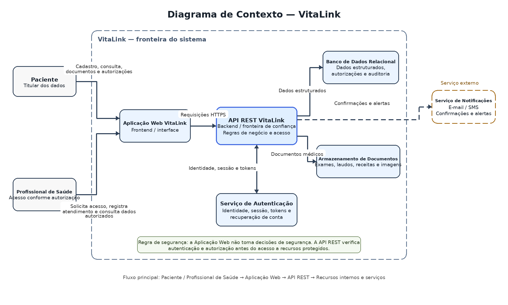

# Diagrama de Contexto do VitaLink

## Visão geral

O diagrama de contexto apresenta os principais atores, componentes internos, fronteiras de confiança e serviço externo associados ao VitaLink. A representação segue a arquitetura documentada para o projeto e evidencia que decisões de autenticação e autorização não são realizadas pela interface, mas aplicadas na API REST antes do acesso aos recursos protegidos.

## Atores externos

### Paciente

O paciente utiliza a Aplicação Web VitaLink para realizar cadastro, consultar informações, enviar dados e documentos médicos e gerenciar autorizações de acesso concedidas a profissionais de saúde.

### Profissional de Saúde

O profissional utiliza a Aplicação Web VitaLink para solicitar acesso aos dados de pacientes, registrar atendimentos e consultar informações dentro do escopo autorizado.

## Componentes do VitaLink

### Aplicação Web VitaLink

Representa o frontend e a interface de interação com pacientes e profissionais. A aplicação coleta entradas e apresenta informações, mas não toma decisões de segurança.

### API REST VitaLink

É o backend do sistema e a principal fronteira de confiança. Recebe requisições da Aplicação Web, aplica regras de negócio e verifica autenticação e autorização antes de permitir qualquer operação sobre recursos protegidos.

### Banco de Dados Relacional

Armazena dados estruturados, incluindo cadastros, perfis, dados médicos, histórico de autorizações e registros de auditoria.

### Armazenamento de Documentos

Mantém arquivos médicos protegidos, como exames, laudos, receitas e imagens. O acesso ocorre por intermédio da API REST.

### Módulo de Autenticação

Módulo interno da API que gerencia o ciclo de vida das identidades, incluindo login, sessões opacas no servidor e recuperação de contas. Ele não representa um serviço separado nem valida token assinado nesta versão.

## Serviço externo

### Serviço de Notificações (E-mail/SMS)

Serviço externo utilizado para envio de confirmações e alertas de segurança, como mensagens de recuperação de conta ou avisos relacionados a ações sensíveis.

## Fluxos principais

1. O paciente envia solicitações à Aplicação Web para cadastro, consulta, envio de dados e gestão de autorizações.
2. O profissional envia solicitações à Aplicação Web para solicitar acesso, registrar atendimentos e consultar dados autorizados.
3. A Aplicação Web encaminha as operações para a API REST por requisições HTTPS.
4. A API REST lê e grava dados estruturados no Banco de Dados Relacional.
5. A API REST realiza upload, recuperação e remoção de arquivos no Armazenamento de Documentos.
6. A API REST usa o módulo interno de autenticação para resolver o cookie de sessão opaca e validar identidade, estado e expirações no servidor.
7. A API REST aciona o Serviço de Notificações para confirmações e alertas de segurança.

## Fronteira de segurança

A Aplicação Web não deve decidir sozinha se um usuário possui acesso a determinado recurso. A API REST é a principal fronteira de confiança do VitaLink e deve verificar autenticação e autorização antes de consultar o Banco de Dados, recuperar documentos do Storage ou executar qualquer operação protegida.

## Arquivos relacionados

- `diagramas/diagrama-contexto.drawio` — arquivo-fonte editável no diagrams.net/Draw.io.
- `diagramas/diagrama-contexto.png` — imagem exportada do diagrama.
- `docs/diagrama-contexto.md` — descrição textual e referência da imagem.
