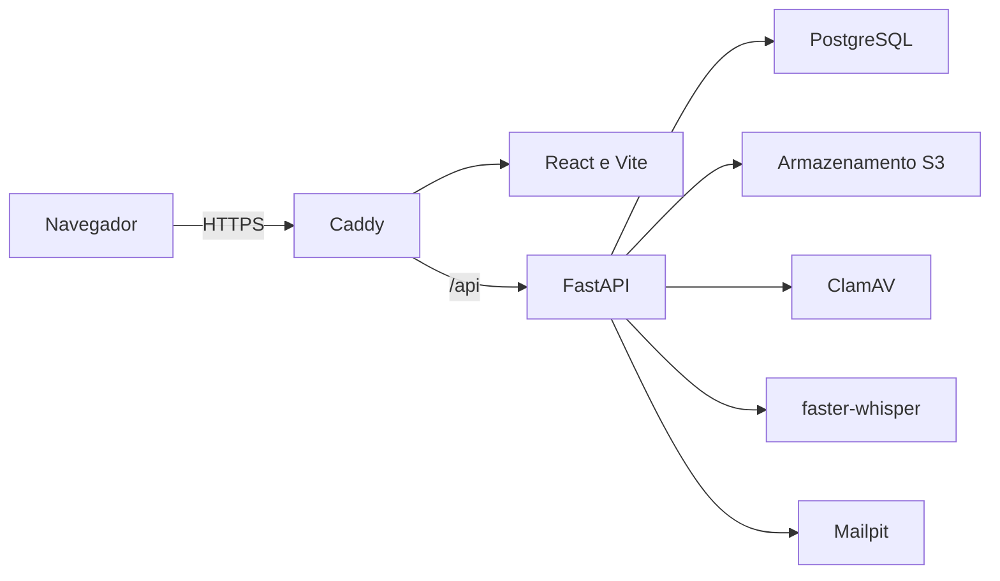

# Plano de implementação da primeira versão do VitaLink

## Status e finalidade

Este documento define o contrato para implementar a primeira versão executável do VitaLink. Ele consolida as decisões aprovadas durante o Grill realizado em 13 de agosto de 2026 e transforma a documentação de segurança existente em comportamentos, componentes e critérios verificáveis.

O documento descreve planejamento. Enquanto não houver código, testes executados e evidências versionadas, nenhum controle deve ser apresentado como implementado.

Embora esta entrega possa ser chamada de MVP no contexto acadêmico, ela não é um recorte mínimo de telas: todas as telas e ações que permanecerem visíveis devem funcionar com dados persistidos. O termo adotado neste documento é **primeira versão**.

## Fontes e precedência

As fontes devem ser interpretadas nesta ordem:

1. [Decisões de segurança](decisoes-de-seguranca.md), requisitos `RS01`–`RS03` e decisões `DA01`–`DA03`.
2. Este plano e o [glossário do domínio](../CONTEXT.md).
3. [Perfis e permissões](usuarios-perfis-e-permissoes.md) e [fluxo de autorização](fluxo-autorizacao-revogacao.md).
4. O [inventário da interface](inventario-interface-primeira-versao.md), o [protótipo do Figma Make](https://www.figma.com/make/R6iSKm93eoSuJrjb8eXZu7/VitaLink-Health-Management-App?p=f&t=mhS5qcfMxCj4rkGz-0) e o código local em `VitaLink Health Management App/`, usados como baseline visual e de interação.

Quando houver conflito, as regras de segurança e de domínio prevalecem sobre o protótipo. O frontend deve preservar a identidade visual, a organização e os padrões de interação do Figma, com os ajustes necessários para segurança, acessibilidade, responsividade e coerência funcional.

## Objetivo da entrega

A primeira versão deve permitir que pacientes e profissionais de saúde usem os fluxos documentados de ponta a ponta, com dados sintéticos:

- criar, confirmar, recuperar e proteger contas individuais;
- manter o próprio perfil;
- solicitar, conceder, limitar, recusar, revogar e expirar acesso;
- registrar e consultar documentos, resultados, consultas, recomendações e metas clínicas;
- visualizar a evolução de resultados estruturados;
- trocar mensagens clínicas entre profissionais autorizados;
- receber notificações internas;
- usar ditado clínico local apenas nos campos clínicos livres do profissional;
- consultar eventos de auditoria permitidos ao próprio perfil.

Nenhum botão, link, filtro, formulário ou ícone de ação pode permanecer apenas decorativo. Um controle fora do escopo deve ser removido da interface.

## Escopo funcional por área

| Área                | Comportamento requerido                                                                                                                                      |
| ------------------- | ------------------------------------------------------------------------------------------------------------------------------------------------------------ |
| Entrada e cadastro  | Cadastro separado de paciente e profissional, confirmação de e-mail, login com senha e TOTP, recuperação de senha e encerramento de sessão.                  |
| Segurança da conta  | Ativação de TOTP, geração de códigos de recuperação, consulta e encerramento de sessões, alteração de senha e reautenticação para ações sensíveis.           |
| Perfil do paciente  | Consulta e edição de dados próprios, observações pessoais de saúde, profissionais autorizados, códigos de acesso temporários e histórico próprio de acessos. |
| Painel do paciente  | Resumo derivado dos dados persistidos, documentos, consultas, resultados, gráficos e recomendações clínicas.                                                 |
| Importação          | Upload de PDF, JPG ou PNG e registro manual de resultados estruturados após conferência.                                                                     |
| Autorizações        | Código temporário, solicitação do profissional, decisão do paciente com categorias, operações e prazo, além de recusa, revogação e expiração.                |
| Perfil profissional | Consulta e edição dos próprios dados profissionais e configurações de segurança, respeitando os campos validados manualmente.                                |
| Painel profissional | Lista apenas de pacientes autorizados, busca e filtros, estado de acompanhamento definido manualmente e acesso ao prontuário dentro do escopo concedido.     |
| Registros clínicos  | Criação de consultas, documentos, resultados, recomendações, observações e metas clínicas com autoria, proveniência e versionamento.                         |
| Equipe e mensagens  | Visualização dos profissionais autorizados para o mesmo paciente e mensagens clínicas textuais entre profissionais elegíveis.                                |
| Notificações        | Caixa interna persistente, leitura individual e eventos de acesso, documentos, mensagens, conta e segurança.                                                 |
| Auditoria           | Consulta pelo paciente ao próprio histórico e pelo profissional aos próprios eventos, sem acesso administrativo aos registros.                               |

### Ajustes obrigatórios em relação ao protótipo

- “Novo paciente” deve iniciar uma solicitação por código de acesso temporário.
- “Compartilhado com” deve ser calculado pelas autorizações ativas que cobrem a categoria do documento.
- Mensagens de áudio devem ser substituídas por texto revisado produzido por ditado.
- Referências de diferentes profissionais devem ser exibidas separadamente; não deve existir média automática.
- Resultados devem usar “abaixo”, “dentro” ou “acima” do intervalo informado, sem diagnóstico automático.
- O estado de acompanhamento do paciente deve ser informado por profissional autorizado, com justificativa e autoria.
- Receita deve ser apenas um documento anexado; o VitaLink não emite nem assina prescrição nesta versão.
- Login social, passkey, biometria e ICP-Brasil devem ser removidos.
- Agenda, OCR, DICOM e compartilhamento público por link devem ser removidos.

## Fora do escopo

- dados, documentos ou contas de pessoas reais;
- envio de e-mails para provedores externos;
- consulta automática a conselhos profissionais ou bases governamentais;
- prova de vida ou validação governamental de paciente;
- perfil administrativo com acesso a dados médicos;
- agenda ou marcação de consultas;
- OCR ou extração automática de exames;
- armazenamento ou envio de áudio;
- arquivos DICOM e visualizador especializado;
- assinatura digital ou emissão de receita com validade jurídica;
- diagnóstico, triagem ou prioridade clínica calculados automaticamente;
- hospedagem pública, alta disponibilidade e operação de produção.

## Decisões de implementação

| ID   | Decisão                                                                                                                                                                  | Origem principal                |
| ---- | ------------------------------------------------------------------------------------------------------------------------------------------------------------------------ | ------------------------------- |
| DI01 | Reaproveitar o frontend React, TypeScript, Vite e Tailwind do Figma Make como base visual.                                                                               | Grill; protótipo                |
| DI02 | Manter apenas controles com comportamento real e persistido.                                                                                                             | Grill                           |
| DI03 | Implementar API REST em FastAPI, PostgreSQL para dados e auditoria e armazenamento compatível com S3 para documentos.                                                    | DA01–DA03; Grill                |
| DI04 | Usar Caddy como única entrada HTTPS; os demais serviços permanecem na rede interna do Docker Compose.                                                                    | DS03; Grill                     |
| DI05 | Usar sessão opaca no servidor por cookie `__Host-`, `HttpOnly`, `Secure`, `SameSite=Strict`, `Path=/` e sem `Domain`, sem token de acesso em `localStorage`.             | DS03, DS06, DS21                |
| DI06 | Exigir senha e TOTP para paciente e profissional; usar e-mail local para confirmação e recuperação.                                                                      | DS03, DS11                      |
| DI07 | Manter profissional pendente até validação por comando administrativo auditado, com identidade explícita do operador.                                                    | DS02, DS12                      |
| DI08 | Identificar o paciente na solicitação somente por código temporário de uso único, válido por 24 horas e revogável.                                                       | DS13                            |
| DI09 | Tratar a autorização como única fonte de acesso a dados médicos; a API reavalia cada operação.                                                                           | DS04–DS06; RS01–RS02; DA01–DA02 |
| DI10 | Exigir TOTP adicional para ações sensíveis e vinculá-lo à ação iniciada por até cinco minutos.                                                                           | DS11                            |
| DI11 | Manter registros clínicos e mensagens imutáveis; correções criam nova versão ou mensagem vinculada.                                                                      | DS07, DS14                      |
| DI12 | Preservar proveniência, autoria, data e documento de origem dos dados clínicos.                                                                                          | DS14                            |
| DI13 | Processar uploads em quarentena, validar conteúdo e usar ClamAV antes da disponibilização.                                                                               | DS10, DS15                      |
| DI14 | Usar resultados estruturados confirmados como única fonte dos gráficos.                                                                                                  | DS16                            |
| DI15 | Gravar áudio no navegador e transcrever localmente com `faster-whisper`; descartar o áudio após o resultado.                                                             | DS17                            |
| DI16 | Persistir notificações internas e capturar e-mails de desenvolvimento no Mailpit.                                                                                        | DS18                            |
| DI17 | Manter auditoria append-only por cinco anos como política inicial, a validar antes de qualquer uso real.                                                                 | DS08, DS19                      |
| DI18 | Executar a aplicação localmente com dados sintéticos e Docker Compose.                                                                                                   | DS20                            |
| DI19 | Permitir ajustes visuais para acessibilidade e responsividade, sem comunicar estados apenas por cor.                                                                     | Grill                           |
| DI20 | Exigir CI em pull requests para `develop`, sem deploy automático nesta versão.                                                                                           | Grill                           |
| DI21 | Desenvolver em fatias verticais TDD, um comportamento público RED→GREEN por vez, acumulando suítes de qualidade e segurança.                                             | DS22; Grill                     |
| DI22 | Reutilizar estrutura, componentes, tokens e padrões do código do Figma Make em toda issue com frontend; desvios exigem segurança, acessibilidade ou decisão documentada. | Grill; protótipo                |

## Arquitetura executável proposta

| Componente       | Responsabilidade                                                                    | Restrição principal                                                                     |
| ---------------- | ----------------------------------------------------------------------------------- | --------------------------------------------------------------------------------------- |
| Caddy            | TLS, frontend e encaminhamento de `/api`.                                           | Único ponto público da aplicação.                                                       |
| Frontend         | Apresentação, validação de usabilidade e coleta de entrada.                         | Nunca decide autorização nem confia em estado local como evidência.                     |
| FastAPI          | Regras de negócio, autenticação, autorização, auditoria e coordenação dos serviços. | Reavalia o acesso no servidor para cada recurso e operação.                             |
| PostgreSQL       | Cadastros, sessões, autorizações, metadados clínicos, notificações e auditoria.     | Restrições, chaves e permissões impedem referências inválidas e alteração da auditoria. |
| Armazenamento S3 | Arquivos aprovados e objetos temporários em quarentena.                             | Não é acessível diretamente pelo navegador.                                             |
| ClamAV           | Varredura local dos uploads.                                                        | Arquivo não aprovado permanece indisponível.                                            |
| faster-whisper   | Transcrição local de gravações temporárias em português.                            | Não persiste áudio nem confirma o texto pelo profissional.                              |
| Mailpit          | Captura local de confirmação, recuperação e alertas.                                | Somente desenvolvimento; não envia mensagens reais.                                     |

O Docker Compose deve criar redes e volumes explicitamente. PostgreSQL, armazenamento, ClamAV e transcrição não devem publicar portas no host. O painel do Mailpit pode ser publicado apenas no perfil de desenvolvimento.

## Modelo de domínio mínimo

| Entidade                     | Dados essenciais                                                                                 | Invariantes                                                                                |
| ---------------------------- | ------------------------------------------------------------------------------------------------ | ------------------------------------------------------------------------------------------ |
| Conta                        | Identificador, perfil, e-mail confirmado, senha em hash, estado e datas.                         | E-mail único; perfil não pode ser alterado pelo usuário.                                   |
| Paciente                     | Conta, nome, CPF, nascimento e contato.                                                          | CPF único e não editável pela interface comum.                                             |
| Profissional                 | Conta, nome, CRM, UF, especialidade e validação.                                                 | Par CRM/UF único; não solicita acesso enquanto estiver pendente.                           |
| Sessão                       | Conta, identificador opaco em hash, criação, último uso e expiração máxima.                      | Expira após 30 minutos de inatividade ou 8 horas no total.                                 |
| Credencial TOTP              | Conta, segredo protegido, estado e data.                                                         | Segredo nunca aparece em logs.                                                             |
| Código de recuperação        | Conta, código em hash, uso e data.                                                               | Uso único; regeneração invalida o conjunto anterior.                                       |
| Chave offline de recuperação | Conta, chave em hash, criação e uso.                                                             | Exibida uma vez após ativação; uso único e sempre combinada com link no e-mail confirmado. |
| Código de acesso temporário  | Paciente, código em hash, criação, expiração, consumo e revogação.                               | Validade de 24 horas e uso único.                                                          |
| Solicitação de acesso        | Paciente, profissional, justificativa, estado e datas.                                           | Não concede acesso; nasce a partir de código válido.                                       |
| Autorização                  | Paciente, profissional, categorias, operações, início, fim e estado.                             | Duração de 1 a 90 dias; padrão de 30 dias; não autoriza exclusão.                          |
| Documento                    | Paciente, categoria, nome interno, tipo real, tamanho, hash, estado da varredura e proveniência. | PDF, JPG ou PNG até 20 MB; conteúdo imutável após aprovação.                               |
| Resultado estruturado        | Paciente, exame, valor, unidade, intervalo, data, origem e versão.                               | Só dados confirmados alimentam gráficos.                                                   |
| Registro clínico             | Paciente, tipo, conteúdo, autor, origem, data e registro substituído.                            | Correção cria nova versão; autoria original não muda.                                      |
| Observação pessoal           | Paciente, texto, data e versão substituída.                                                      | Só o paciente cria, consulta ou corrige; não é consulta profissional.                      |
| Consulta                     | Paciente, profissional, data, resumo e vínculos com documentos.                                  | Profissional precisa da operação `anexar`; não representa agenda.                          |
| Recomendação clínica         | Paciente, profissional, texto, data e vínculos.                                                  | Não é receita nem diagnóstico automático.                                                  |
| Meta clínica                 | Paciente, profissional, exame, limites, unidade, data e observação.                              | Cada meta mantém autoria; não há média entre profissionais.                                |
| Estado de acompanhamento     | Paciente, profissional, estado, justificativa, data e versão substituída.                        | Manual, exige autorização para `metas`; correção preserva histórico e autoria.             |
| Mensagem clínica             | Paciente, remetente, destinatário, texto, data e mensagem corrigida.                             | Ambos os profissionais precisam de autorização ativa; mensagem enviada é imutável.         |
| Notificação                  | Destinatário, tipo, referência, criação e leitura.                                               | Leitura é individual; não substitui auditoria.                                             |
| Evento de auditoria          | Ator, ação, alvo, resultado, motivo, horário, correlação e metadados mínimos.                    | Append-only; não contém segredo nem conteúdo clínico.                                      |

Todos os horários devem ser persistidos em UTC e apresentados no fuso do usuário. Identificadores expostos pela API devem ser imprevisíveis. Chaves estrangeiras, unicidade e limites devem existir no banco, além da validação da API.

## Estados e fluxos obrigatórios

### Ativação e recuperação da conta

1. O cadastro cria conta `aguardando_confirmacao` sem sessão completa.
2. A confirmação de e-mail cria uma sessão de ativação restrita a configurar e confirmar o primeiro TOTP.
3. A confirmação do TOTP encerra a sessão restrita, gera códigos de recuperação e permite login completo.
4. Recuperar apenas a senha preserva o TOTP e invalida todas as sessões.
5. Paciente sem TOTP e sem códigos usa link enviado ao e-mail já confirmado e a chave offline gerada após a ativação; profissional retorna à validação manual.
6. A recuperação reforçada invalida sessões, códigos e segredo TOTP anteriores e exige novo cadastramento do fator.

Respostas públicas não revelam se e-mail, CPF ou CRM existem. Login, TOTP, códigos e recuperação usam limites progressivos por conta e origem.

### Cadastro profissional

1. O profissional informa nome, e-mail, especialidade, CRM, UF e credenciais.
2. O sistema valida formato e unicidade, envia confirmação ao Mailpit e mantém a conta pendente.
3. Um operador executa comando administrativo local informando sua própria identidade, decisão e justificativa. O comando aceita apenas transições `pendente → aprovado` ou `pendente → rejeitado`, é idempotente para repetição idêntica e registra auditoria.
4. Somente depois da aprovação o profissional pode solicitar acesso a pacientes.

Não haverá painel de administrador. O procedimento interno não concede acesso a dados médicos.

### Solicitação e autorização

1. O paciente autenticado gera um código de acesso temporário.
2. O profissional validado consome o código uma única vez e envia justificativa.
3. O paciente recebe notificação e decide entre recusar ou conceder.
4. Para conceder, o paciente confirma categorias, operações e prazo com TOTP adicional.
5. Cada operação do profissional reavalia a autorização na API.
6. Revogação, expiração ou redução de escopo impedem imediatamente novos acessos.

O profissional não localiza pacientes por nome, CPF ou e-mail. O código revela apenas os dados mínimos necessários para confirmar a solicitação e nunca revela conteúdo clínico.

### Upload e visualização

1. A API rejeita arquivos acima de 20 MB e tipos não permitidos.
2. O arquivo recebe nome interno imprevisível e entra em quarentena.
3. A API verifica assinatura real, tamanho e consistência do conteúdo.
4. O ClamAV aprova ou rejeita o arquivo.
5. Apenas o arquivo aprovado fica disponível.
6. Visualização e download reavaliam autorização e geram auditoria.

O navegador não recebe caminho interno nem URL pública permanente do objeto.

### Ditado clínico

1. Campos clínicos livres de consulta, recomendação, meta, mensagem e correção oferecem botão de microfone.
2. O navegador grava até dois minutos por tentativa com `MediaRecorder`.
3. A API envia o áudio temporário ao serviço local de transcrição.
4. O serviço retorna texto em português e o áudio é descartado.
5. O texto entra no campo como rascunho editável.
6. Somente a confirmação explícita do profissional cria ou altera o registro.

O modelo inicial deve ser configurável, com `small` e CPU `int8` como padrão para a demonstração. A configuração pode ser revista após medição no hardware real.

Credenciais, TOTP, códigos, e-mail, CRM, CPF, buscas, filtros e justificativas administrativas não oferecem ditado.

### Correção de conteúdo clínico

- registros clínicos não são excluídos;
- uma correção aponta para a versão anterior e exige motivo;
- mensagens enviadas não são editadas nem excluídas;
- uma correção de mensagem é uma nova mensagem vinculada;
- receitas permanecem documentos anexados e imutáveis;
- pacientes alteram apenas dados criados por eles, conforme DS07.

## Contrato inicial da API

A API deve usar o prefixo `/api/v1`, JSON para dados e `multipart/form-data` somente para arquivos e áudio temporário. Erros devem possuir código estável, mensagem segura e identificador de correlação, sem detalhes internos.

| Recurso                                            | Operações públicas esperadas                      | Regras essenciais                                                        |
| -------------------------------------------------- | ------------------------------------------------- | ------------------------------------------------------------------------ |
| `/patient-registrations`                           | Criar cadastro.                                   | Resposta anti-enumeração; e-mail e CPF únicos.                           |
| `/professional-registrations`                      | Criar cadastro pendente.                          | CRM/UF único; nenhuma autorização antes da validação.                    |
| `/email-verifications`                             | Confirmar código de uso único.                    | Expiração, uso único e auditoria.                                        |
| `/sessions`                                        | Criar, listar e encerrar sessões.                 | Cookie seguro; limite de tentativas; expirações de DS03.                 |
| `/password-recovery-requests` e `/password-resets` | Solicitar e concluir recuperação.                 | Resposta genérica; token em hash; invalidação de sessões.                |
| `/totp`                                            | Ativar, confirmar e recuperar segundo fator.      | Códigos de recuperação em hash e uso único.                              |
| `/step-up-confirmations`                           | Confirmar TOTP para uma ação sensível.            | Vínculo com ação e validade máxima de cinco minutos.                     |
| `/me`                                              | Consultar e editar o próprio perfil.              | Campos de identidade validados não mudam sem fluxo específico.           |
| `/personal-observations`                           | Criar, consultar e corrigir observações próprias. | Somente paciente proprietário; separado de consulta clínica.             |
| `/access-codes`                                    | Criar, listar e revogar códigos temporários.      | Somente paciente; 24 horas; uso único.                                   |
| `/access-requests`                                 | Criar e listar solicitações.                      | Profissional validado; justificativa; código válido.                     |
| `/access-requests/{id}/decisions`                  | Conceder ou recusar.                              | Somente paciente-alvo; TOTP para concessão; escopo e prazo válidos.      |
| `/authorizations`                                  | Listar autorizações do usuário.                   | Resultado filtrado pelo usuário autenticado.                             |
| `/authorizations/{id}/revocations`                 | Revogar autorização.                              | Somente paciente-alvo; TOTP; efeito imediato.                            |
| `/patients`                                        | Listar e consultar pacientes autorizados.         | Profissional vê somente autorizações ativas; paciente vê apenas a si.    |
| `/documents`                                       | Criar e listar metadados e iniciar upload.        | Categoria e operação autorizadas; quarentena obrigatória.                |
| `/documents/{id}/content`                          | Visualizar ou baixar conteúdo.                    | Reautorização por requisição; auditoria; sem URL pública.                |
| `/clinical-results`                                | Criar, consultar e corrigir resultados.           | Proveniência e versionamento; somente confirmados alimentam gráficos.    |
| `/consultations`                                   | Criar, consultar e corrigir consultas.            | Não implementa agenda; exige escopo clínico.                             |
| `/recommendations`                                 | Criar e consultar recomendações.                  | Autoria profissional; não representa prescrição.                         |
| `/clinical-goals`                                  | Criar e consultar metas por profissional.         | Sem agregação automática entre autores.                                  |
| `/follow-up-statuses`                              | Criar, consultar e corrigir acompanhamento.       | Estado manual, justificativa, autoria e histórico.                       |
| `/clinical-messages`                               | Enviar, consultar e corrigir mensagens.           | Dois profissionais autorizados para o mesmo paciente; conteúdo imutável. |
| `/notifications`                                   | Listar e marcar notificações como lidas.          | Somente destinatário.                                                    |
| `/audit-events`                                    | Consultar a visão permitida ao usuário.           | Paciente vê o próprio histórico; profissional vê os próprios eventos.    |
| `/transcriptions`                                  | Enviar áudio temporário e receber rascunho.       | Somente profissional; limite de dois minutos; descarte do áudio.         |

Operações de escrita com sessão em cookie exigem token CSRF vinculado à sessão e `Origin` permitido. A API deve validar corpo, parâmetros, tipo de conteúdo, tamanho e propriedade do recurso; identificadores recebidos do cliente nunca são autoridade suficiente.

A validação profissional não é endpoint público. Um comando administrativo usa o mesmo serviço de aplicação e banco da API, exige identidade explícita do operador e produz evento auditável sem permitir leitura clínica.

## Autenticação e proteção da conta

- senhas devem ter entre 12 e pelo menos 64 caracteres, aceitar espaços e Unicode e nunca sofrer truncamento silencioso;
- não deve haver composição artificial obrigatória nem troca periódica;
- senhas comuns ou comprometidas devem ser rejeitadas por lista local versionada, sem enviar a senha a serviço externo;
- senhas devem ser armazenadas com Argon2id;
- respostas de login e recuperação não devem confirmar a existência da conta;
- tentativas devem sofrer limitação progressiva por conta e origem;
- paciente e profissional devem usar TOTP;
- códigos de recuperação devem ser exibidos uma vez e armazenados em hash;
- paciente sem TOTP e sem código usa dois fatores de recuperação independentes cadastrados; profissional passa novamente pela validação manual;
- recuperação de conta invalida sessões e códigos anteriores e gera alerta;
- alteração de e-mail, senha, concessão, revogação, criação ou correção clínica, mensagem clínica e download médico exigem TOTP adicional;
- confirmação adicional vale por até cinco minutos e apenas para a ação iniciada.

## Autorização

A autorização deve ser aplicada no servidor com política de negação por padrão. Para cada ação sobre dado médico, a API compara:

- identidade e perfil autenticados;
- paciente proprietário;
- profissional solicitante, quando aplicável;
- categoria do dado;
- operação solicitada;
- estado da autorização;
- início e fim do prazo.

O acesso não pode ser mantido em cache além de uma forma que preserve a revogação imediata. Ocultar conteúdo na interface, conhecer um identificador ou possuir uma sessão válida não concede permissão.

Mensagens clínicas exigem que remetente e destinatário tenham autorização ativa para o mesmo paciente. Após revogação ou expiração, as mensagens permanecem retidas, mas ficam indisponíveis ao profissional sem acesso.

### Matriz normativa de recurso e autorização

| Recurso                                      | Categoria                | Criar                                  | Consultar              | Corrigir                                           |
| -------------------------------------------- | ------------------------ | -------------------------------------- | ---------------------- | -------------------------------------------------- |
| Observação pessoal                           | `histórico`              | Paciente proprietário                  | Paciente proprietário  | Paciente proprietário                              |
| Consulta e anotação profissional             | `consultas`              | `anexar`                               | `consultar`            | `atualizar`                                        |
| Resultado estruturado                        | `exames`                 | `anexar`                               | `consultar`            | `atualizar`                                        |
| Documento de exame, laudo, receita ou imagem | Categoria correspondente | `anexar`                               | `consultar`            | Não altera conteúdo; nova versão exige `atualizar` |
| Recomendação clínica                         | `recomendações`          | `anexar`                               | `consultar`            | `atualizar`                                        |
| Meta clínica e estado de acompanhamento      | `metas`                  | `anexar`                               | `consultar`            | `atualizar`                                        |
| Mensagem clínica                             | `mensagens`              | `anexar` para remetente e destinatário | `consultar` para ambos | `atualizar` por nova mensagem vinculada            |

Uma autorização em categoria diferente nunca satisfaz a operação. Para mensagens, os dois profissionais precisam de `mensagens` e da operação correspondente para o mesmo paciente.

## Integridade e interpretação clínica

- o sistema não calcula diagnóstico, urgência nem prioridade clínica;
- comparação de resultado usa somente o intervalo e a unidade informados;
- intervalo do laboratório e meta clínica do profissional são dados distintos;
- estado de acompanhamento é informado manualmente por profissional autorizado e exige justificativa;
- autoria, proveniência e histórico de correções são imutáveis;
- anexar um arquivo não cria resultados estruturados automaticamente;
- gráficos usam apenas valores estruturados confirmados e mostram data, unidade, origem e referência.

## Upload seguro

- tipos permitidos: PDF, JPG e PNG;
- tamanho máximo: 20 MB por arquivo;
- quota total inicial: 200 MB por paciente, configurável e aplicada antes de aceitar o upload;
- validação por assinatura real e conteúdo, não apenas extensão ou cabeçalho enviado;
- nome de armazenamento gerado pelo servidor;
- quarentena separada do armazenamento aprovado;
- varredura pelo ClamAV antes de qualquer leitura;
- rejeição segura e eliminação do objeto em quarentena quando inválido;
- conteúdo é servido em origem isolada, com `Content-Type` seguro, `Content-Disposition` apropriado, CSP restritiva e `X-Content-Type-Options: nosniff`; quando a visualização isolada não for segura, o arquivo é entregue como anexo;
- reautorização e auditoria em visualização e download;
- nenhuma URL pública ou permanente.

## Auditoria e notificações

### Eventos auditáveis

Toda chamada à API pública gera registro operacional mínimo com correlação, rota normalizada, método, resultado e duração, sem parâmetros ou conteúdo sensível. Devem gerar também evento de auditoria, com sucesso ou negação quando aplicável:

- cadastro, confirmação, login, logout, recuperação, TOTP e sessões;
- validação manual do profissional;
- criação, consumo e revogação de código temporário;
- solicitação, concessão, recusa, alteração, revogação e expiração de autorização;
- consulta, criação, correção, visualização e download de conteúdo clínico;
- upload, aprovação e rejeição de arquivo;
- envio, leitura e correção de mensagem clínica;
- solicitação, sucesso, falha e confirmação de transcrição;
- criação e leitura de notificações de segurança.
- execução e resultado de comando administrativo, tarefa de fundo, backup, restauração e falha de dependência relevante.

O evento deve conter identificador, ator, ação, alvo, resultado, motivo, horário, identificador de correlação e metadados mínimos. Não deve conter senha, segredo TOTP, token completo, áudio, texto de mensagem, conteúdo clínico ou conteúdo de arquivo.

Ator e alvo usam identificadores pseudônimos. Nome, e-mail e CPF não entram nos metadados. Caracteres de controle e quebras de linha são neutralizados antes da gravação. Uma operação clínica ou de segurança auditável só é confirmada se seu evento for persistido atomicamente; falha da auditoria desfaz a operação.

A tabela de auditoria deve ser append-only. A função de escrita não pode conceder à aplicação permissão de atualizar ou excluir eventos. A retenção inicial é de cinco anos e deve ser validada juridicamente e institucionalmente antes de qualquer uso com dados reais.

### Notificações internas

Devem existir notificações para solicitação, decisão e revogação de acesso, documento disponibilizado, mensagem clínica, recuperação de conta e tentativa negada relevante. Marcar uma notificação como lida não altera o evento de auditoria.

E-mails ficam restritos a confirmação, recuperação e alertas de segurança, todos capturados no Mailpit nesta versão.

## Dados sintéticos e privacidade da demonstração

- a interface deve sinalizar que o ambiente é uma demonstração;
- sementes devem conter apenas identidades, documentos e eventos sintéticos;
- não deve haver integração externa nem telemetria com conteúdo clínico;
- logs, relatórios de teste e artefatos de CI não podem conter segredos ou conteúdo clínico;
- arquivos de exemplo devem ser criados especificamente para a demonstração.

O ambiente sintético deve possuir comando documentado de backup e restauração para PostgreSQL, objetos e auditoria, com teste de integridade e execução periódica no CI compatível com seu custo. Criptografia em repouso, gestão de chaves, base legal, política definitiva de retenção, operação de backup de produção e requisitos regulatórios precisam ser definidos antes de sair do ambiente sintético. Esta versão não é autorização para tratar dados reais.

## Acessibilidade e compatibilidade

- navegação completa por teclado e foco visível;
- rótulos programáticos em campos e botões;
- mensagens de erro associadas ao campo e compreensíveis;
- contraste suficiente e estados comunicados também por texto;
- modais com foco controlado e fechamento acessível;
- layout responsivo conforme o padrão visual do protótipo;
- gravação com tratamento para permissão negada, microfone indisponível e formato não suportado;
- digitação manual sempre disponível como alternativa ao ditado.

## Estratégia de testes

A matriz normativa das suítes e sua relação com ameaças e riscos está na [Etapa 5 — Verificação de segurança](etapa5-verificacao-de-seguranca.md).

### Regra TDD por fatia

Cada issue implementável deve repetir ciclos pequenos, nunca uma fase horizontal de testes:

1. selecionar um comportamento observável pela interface pública;
2. escrever um teste que falhe pelo motivo esperado e registrar a evidência RED;
3. implementar somente o necessário para o teste ficar verde;
4. executar a suíte afetada e registrar a evidência GREEN;
5. refatorar apenas com a suíte verde;
6. adicionar o próximo comportamento, um teste por vez.

Testes exercitam UI ou API pública e serviços reais do Docker Compose. Não verificam métodos privados nem simulam colaboradores internos. Dublês são permitidos somente em fronteiras externas inexistentes nesta versão, tempo e aleatoriedade, sem substituir PostgreSQL, armazenamento, ClamAV, Mailpit ou transcrição nos testes de integração.

### Integração

Os testes devem usar instâncias reais dos serviços no Docker Compose e cobrir, no mínimo:

- login, TOTP, recuperação, CSRF e expiração de sessão;
- acesso permitido somente dentro do paciente, categoria, operação e prazo;
- bloqueio imediato após revogação ou expiração;
- isolamento entre pacientes e entre profissionais;
- código temporário expirado, consumido e revogado;
- imutabilidade e versionamento de registros e mensagens;
- upload válido, tipo falso, excesso de tamanho e arquivo rejeitado pelo ClamAV;
- descarte do áudio após sucesso ou falha de transcrição;
- auditoria de sucesso e negação sem conteúdo sensível;
- notificações geradas pelos eventos correspondentes.

### Ponta a ponta

Deve existir ao menos um teste para cada jornada:

1. paciente cria e protege a conta;
2. profissional cria conta e passa pela validação manual;
3. paciente gera código, profissional solicita e paciente concede acesso;
4. profissional consulta e registra conteúdo dentro do escopo;
5. paciente revoga e o próximo acesso é negado;
6. paciente envia documento e registra resultado manual;
7. profissional usa ditado, revisa e confirma um texto;
8. dois profissionais autorizados trocam e corrigem mensagem clínica;
9. paciente consulta seu histórico de acessos.

### Verificações de interface

- todas as rotas e controles visíveis possuem comportamento real;
- filtros, estados vazios, erros, carregamento e negações são exibidos;
- dados persistem após recarregar a página;
- identidade visual permanece fiel ao protótipo;
- fluxos críticos funcionam por teclado e não dependem apenas de cor.

### Suítes acumuladas de qualidade e segurança

- **Contrato e unidade:** validações puras, esquemas, estados e invariantes complexos, sem duplicar cobertura da interface pública.
- **Integração:** API com PostgreSQL, armazenamento, ClamAV, Mailpit e transcrição reais.
- **Ponta a ponta:** jornadas completas no navegador, incluindo estados vazio, carregamento, erro e negação.
- **Autorização negativa:** matriz paciente × profissional × recurso × operação × estado × prazo, incluindo IDOR, acesso cruzado e revogação imediata.
- **Autenticação e abuso:** enumeração, força bruta, TOTP, recuperação, fixação/roubo de sessão, CSRF e reautenticação.
- **Upload hostil:** extensão falsa, assinatura inválida, conteúdo ativo, malware, arquivo grande, quota, nomes maliciosos e falha do scanner.
- **Auditoria e privacidade:** completude, atomicidade, append-only, log injection e ausência de segredos, PII e conteúdo clínico.
- **Acessibilidade e visual:** teclado, foco, rótulos, contraste e regressão nos viewports definidos no inventário da interface.
- **Desempenho e resiliência:** limites, carga controlada, indisponibilidade de dependência, backup e restauração sintética com verificação de integridade.
- **Segurança automatizada:** análise estática, dependências, imagens, segredos e configuração do Compose/Caddy.

Casos derivados de T01–T15, CA01–CA10 e R01–R15 devem aparecer na suíte de segurança aplicável. Cobertura de linhas é indicador auxiliar e não substitui os comportamentos; o CI deve impedir redução do limiar acordado depois que uma baseline real for medida.

## Integração contínua

Cada pull request para `develop` deve executar:

1. formatação, lint e verificação de tipos;
2. build do frontend e do backend;
3. testes de integração e ponta a ponta;
4. varredura de dependências e imagens;
5. detecção de segredos;
6. análise estática de segurança;
7. publicação de evidências sem dados sensíveis.

O merge exige todos os checks aprovados. O pipeline não realiza deploy nesta versão.

## Rastreabilidade de segurança

| Controle da primeira versão         | Fonte                                                   | Evidência mínima                                                      |
| ----------------------------------- | ------------------------------------------------------- | --------------------------------------------------------------------- |
| Validação manual de profissional    | DS02, DS12; T01; R01                                    | Teste impede conta pendente de solicitar acesso e registra aprovação. |
| Senha, TOTP, recuperação e sessão   | DS03, DS11; T02; R02                                    | Testes de expiração, recuperação, códigos de uso único e invalidação. |
| Autorização por recurso e operação  | DS04–DS06, DS13; RS01–RS02; DA01–DA02; T03–T06; R03–R06 | Testes positivos e negativos, incluindo revogação imediata.           |
| Integridade e versionamento clínico | DS07, DS14, DS16; T07–T09; R07–R09                      | Testes impedem exclusão e preservam autoria e versão anterior.        |
| Upload isolado e autorizado         | DS10, DS15; T10, T14–T15; R10, R14–R15                  | Testes de tipo real, limite, malware, autorização e falha segura.     |
| Limitação e anti-enumeração         | DS10; T11, T13; R11, R13                                | Testes de respostas genéricas, limites e alertas.                     |
| Auditoria append-only               | DS08, DS19; RS03; DA03; T09, T12; R09, R12              | Testes de evento, conteúdo proibido e impossibilidade de alteração.   |
| Ditado local com confirmação        | DS17; T07, T09; R07, R09                                | Teste descarta áudio e não salva texto sem confirmação.               |
| Demonstração sintética              | DS20                                                    | Verificação das sementes, integrações e sinalização do ambiente.      |

## Ordem inicial de implementação

1. Paciente cadastra, confirma e-mail, ativa TOTP e entra pelo frontend do protótipo.
2. Paciente recupera a conta e controla sessões.
3. Profissional cadastra-se, é validado pelo comando auditado e entra.
4. Paciente gera código, profissional solicita e paciente decide o acesso.
5. Profissional consulta somente o recurso e a operação autorizados; revogação nega o acesso seguinte.
6. Paciente registra observação, envia documento seguro e confirma resultado estruturado.
7. Profissional registra e corrige consulta, recomendação, meta e acompanhamento dentro do escopo.
8. Profissionais autorizados trocam mensagens clínicas e usam ditado nos campos clínicos permitidos.
9. Usuários consultam notificações e sua visão de auditoria.
10. A suíte acumulada comprova segurança, acessibilidade, carga, backup, restauração e fidelidade ao protótipo.

Cada item é dividido em fatias menores nas issues e inclui UI, API, persistência, auditoria e ciclos TDD próprios. CI e testes começam na primeira fatia e crescem com todas as seguintes.

## Definition of Done

A primeira versão estará concluída somente quando:

- `docker compose up` iniciar o ambiente local documentado;
- migrações e sementes sintéticas forem reproduzíveis;
- todas as telas mantidas do protótipo usarem a API e dados persistidos;
- cada issue de frontend demonstrar reutilização do código em `VitaLink Health Management App/` e conformidade com o inventário da interface;
- nenhum controle visível for decorativo ou simulado;
- recursos fora do escopo tiverem sido removidos da interface;
- autorização for decidida no servidor e testada nos caminhos de negação;
- revogação e expiração bloquearem o próximo acesso;
- uploads passarem por quarentena e varredura;
- áudio temporário for descartado e texto exigir confirmação;
- auditoria append-only cobrir as ações definidas sem conteúdo sensível;
- evidências RED e GREEN existirem para cada fatia implementada;
- suítes de contrato, integração, ponta a ponta, autorização negativa, abuso, upload, auditoria, acessibilidade, resiliência e segurança automatizada estiverem aprovadas;
- verificações de acessibilidade essenciais estiverem aprovadas;
- CI estiver ativo em pull requests para `develop`;
- documentação e evidências corresponderem ao comportamento executável;
- a aplicação estiver identificada como demonstração com dados sintéticos.

Qualquer item sem teste ou evidência permanece **[A confirmar]** e não pode ser declarado como controle implementado.
